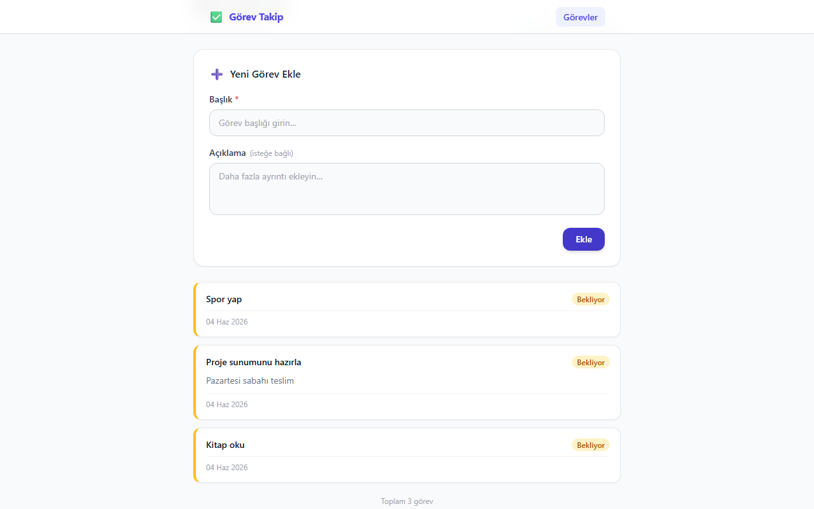
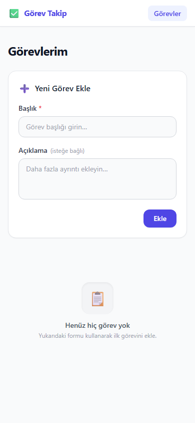

# ✅ Görev Takip — Kişisel Görev & Not Yönetim Uygulaması

Günlük görevlerini ekleyip, düzenleyip, tamamlandı olarak işaretleyebildiğin ve silebildiğin minimal bir CRUD uygulaması.



---

## 🚀 Özellikler

- **Görev Ekleme** — Başlık ve açıklama ile yeni görev oluştur
- **Görev Listeleme** — Tüm görevler kart görünümünde listelenir; sayfa yenilenince LocalStorage'dan otomatik yüklenir
- **Görev Güncelleme** — Herhangi bir kartın "Düzenle" butonuyla formu düzenleme moduna al, kaydet
- **Görev Silme** — "Sil" butonuyla inline onay diyaloğu göster, onaylanınca kalıcı sil
- **Durum Takibi** — Her görev "Bekliyor" veya "Tamamlandı" durumunda olabilir
- **Kalıcı Veri** — Tüm veriler tarayıcının LocalStorage'ında saklanır
- **Karanlık Mod** — Sistem tercihine göre otomatik açık/koyu tema
- **Responsive Tasarım** — Masaüstü, tablet ve mobil uyumlu

---

## 📸 Ekran Görüntüleri

| Masaüstü | Mobil |
|---|---|
|  |  |

---

## 🛠️ Kullanılan Teknolojiler

| Teknoloji | Amaç |
|---|---|
| **React 19 + Vite** | UI framework & geliştirme ortamı |
| **Tailwind CSS v3** | Utility-first stil kütüphanesi |
| **React Router v7** | Sayfa yönlendirme (404 dahil) |
| **LocalStorage API** | Tarayıcı tabanlı veri saklama |
| **Git & GitHub** | Versiyon kontrol & kod paylaşımı |
| **Netlify** | Ücretsiz statik site yayınlama |

---

## ⚙️ Kurulum

### Gereksinimler

- Node.js ≥ 18
- npm ≥ 9

### Adımlar

```bash
# 1. Repoyu klonla
git clone https://github.com/KULLANICI_ADIN/REPO_ADIN.git
cd REPO_ADIN

# 2. Bağımlılıkları kur
npm install

# 3. Geliştirme sunucusunu başlat
npm run dev
```

Tarayıcıda [http://localhost:5173](http://localhost:5173) adresini aç.

### Build

```bash
npm run build       # dist/ klasörüne üretim build'i oluşturur
npm run preview     # Build'i yerel olarak önizle
```

---

## 📂 Proje Yapısı

```
src/
├── components/
│   ├── Navbar.jsx        # Uygulama başlığı ve navigasyon
│   ├── TaskForm.jsx      # Ekleme & güncelleme formu (add/edit modu)
│   └── TaskCard.jsx      # Tekil görev kartı; düzenle & sil
├── pages/
│   ├── HomePage.jsx      # Form + liste; tüm state burada
│   └── NotFoundPage.jsx  # 404 sayfası
├── interfaces/
│   └── taskInterface.js  # Task veri modeli & createTask() yardımcısı
├── App.jsx               # Router + sayfa yapısı
└── main.jsx              # React kök render
```

---

## 🌐 Canlı Demo

> [https://thunderous-manatee-8b7f6c.netlify.app](https://thunderous-manatee-8b7f6c.netlify.app)
>

---

## 📄 Lisans

MIT
